# Лабораторная работа № 2 Интеграция сервиса для получения данных профиля пользователя.
Отчет по лабораторной работе №2 выполнил:
- Строшков Артем Валерьевич
- РИ-300004

Отметка о выполнении заданий (заполняется студентом):

| Задание | Выполнение | Баллы |
| ------ | ------ | ------ |
| Задание 1 | * |  |
| Задание 2 | * |  |
| Задание 3 | # |  |

знак "*" - задание выполнено; знак "#" - задание не выполнено;

Работу проверили:
- к.т.н., доцент Денисов Д.В.
- к.э.н., доцент Панов М.А.
- ст. преп., Фадеев В.О.

Структура отчета

- Данные о работе: название работы, фио, группа, выполненные задания.
- Цель работы.
- Задание 1.
- Код реализации выполнения задания. Визуализация результатов выполнения (если применимо).
- Задание 2.
- Код реализации выполнения задания. Визуализация результатов выполнения (если применимо).
- Задание 3.
- Код реализации выполнения задания. Визуализация результатов выполнения (если применимо).
- Выводы.
- ✨Magic ✨

## Цель работы
Создание интерактивного приложения и изучение принципов интеграции в него игровых сервисов.

## Задание 1
### По теме видео практических работ 1-5 повторить реализацию игры на Unity. Привести описание выполненных действий.

#### Ход работы (задание 1).
1) Создать новый проект из шаблона 3D – Core;
2) Скачать и импортировать нужные ассеты

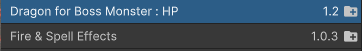

3) Взять готовый префаб дракона и разместить на сцене
 
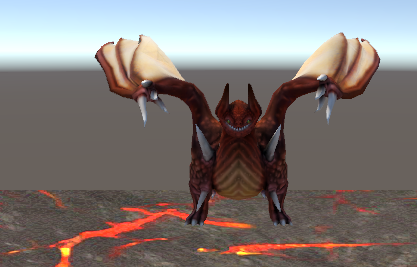

4) Создать контроллер анимации и добавить дракону анимацию полета

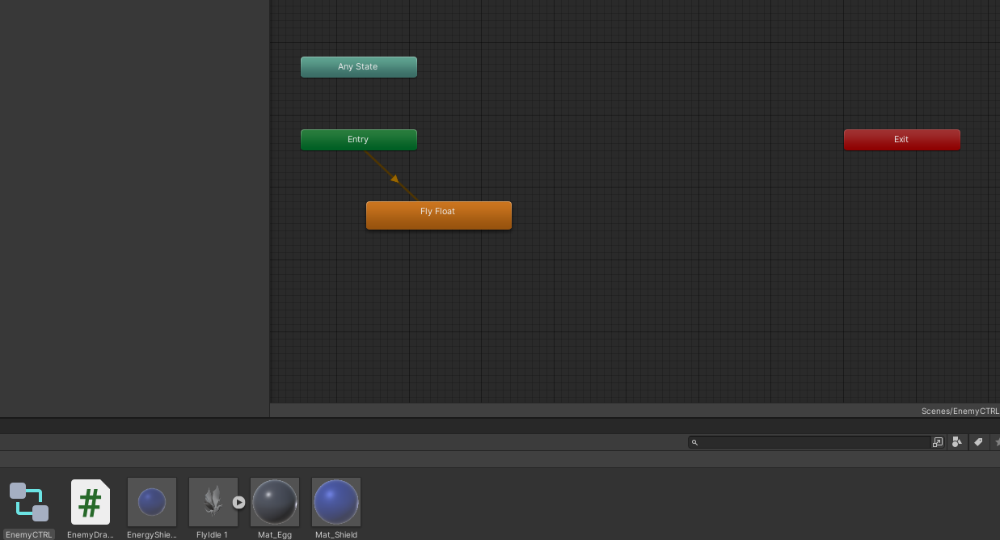
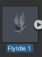

5) Создать объект драконьего яйца, сделать префаб

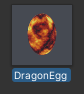

6) Создать объект энергетического щита, сделать префаб

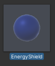

7) Настроить главную камеру

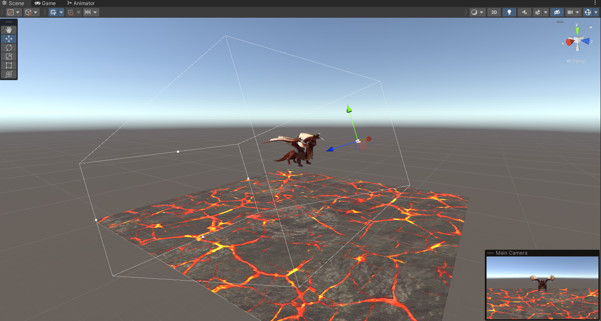

8) Код C# для появления яйца, изменение направления полета дракона. Подключить префаб яйца

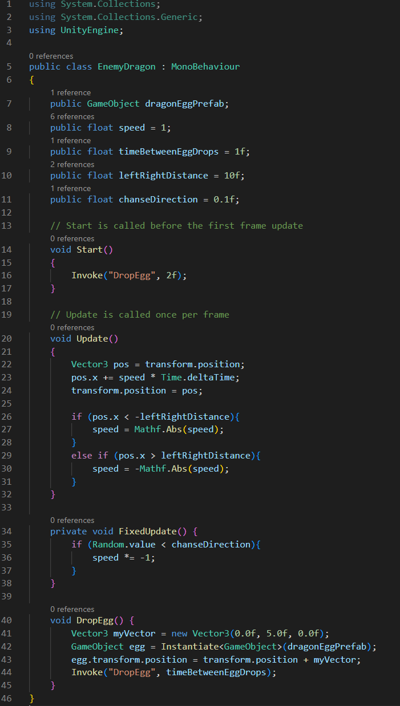
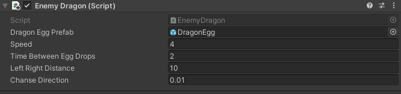

9) Добавить эффект взрыва при касании яйца земли, добавить землю

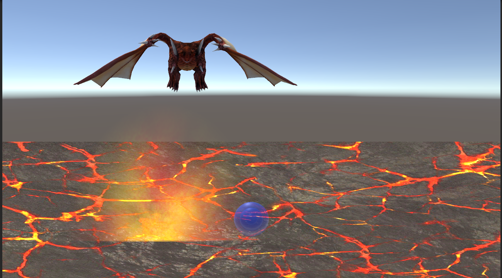
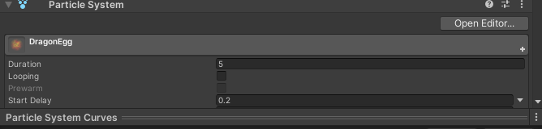

10) Написать скрипт, который будет управлять игрой

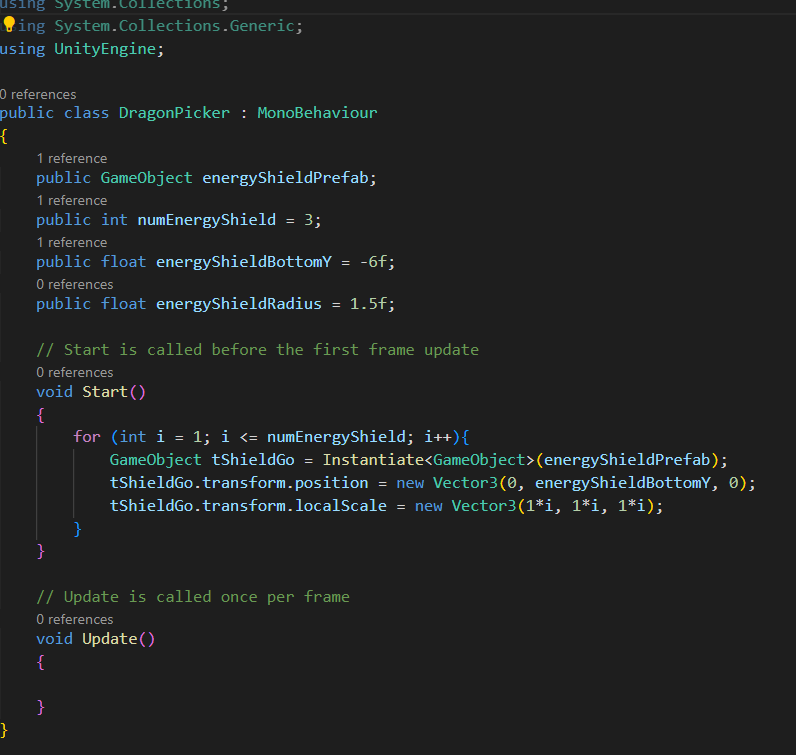

11) В консоли разработчика "Яедкс Игры" создать черновик добавления игры

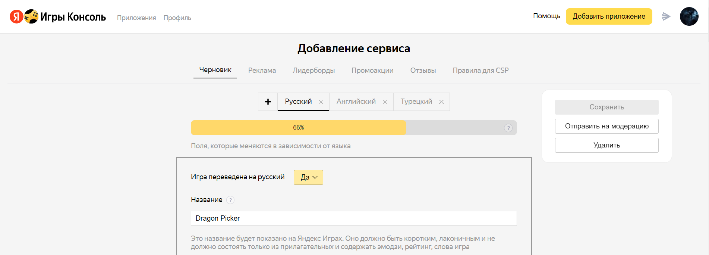

## Задание 2
### В проект, выполненный в предыдущем задании, добавить систему проверки того, что SDK подключен (доступен в режиме онлайн и отвечает на запросы);

#### Ход работы (задание 2).
1) Импотрировать плагин PluginYG
2) Написать скрипт:

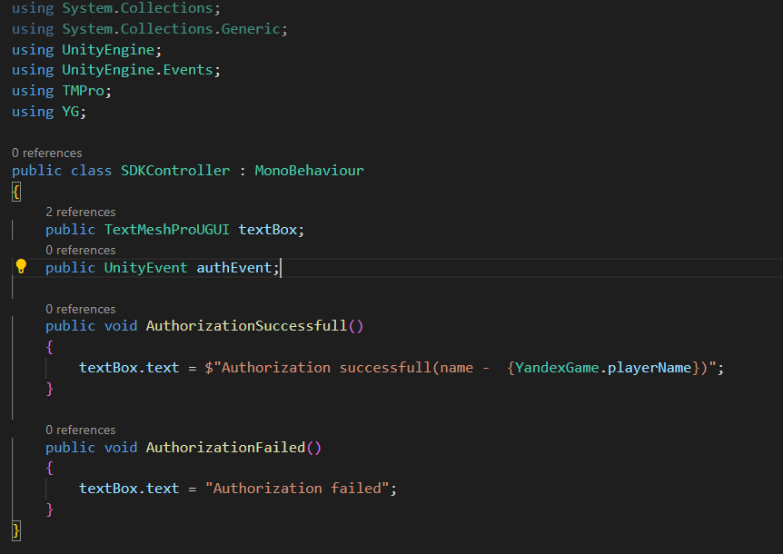

3) Добавить на сцену пустой объект, в который добавить написанный скрипт

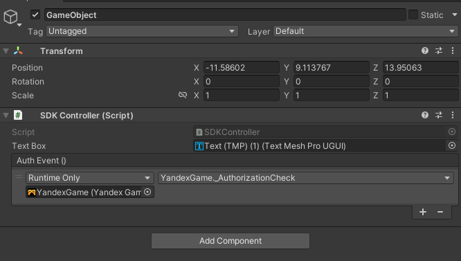

4) Добавить на сцену готовый префаб YandexGame, настроить его

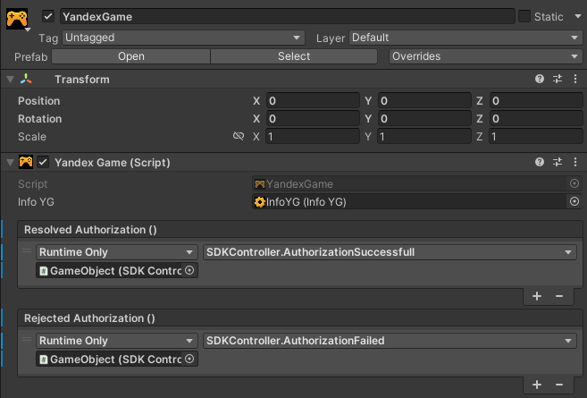

5) При запуске игры через сервис Яндекс игры на месте "unauthorized" будет написано имя пользователя

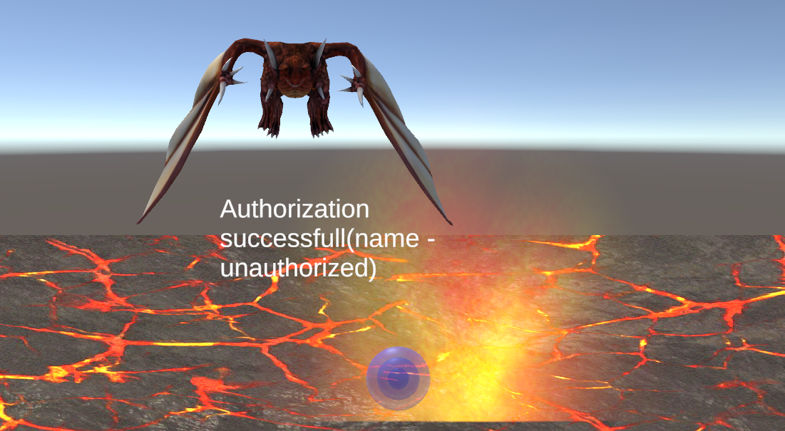

## Задание 3
### 1 Произвести сравнительный анализ игровых сервисов Яндекс Игры и VK Game;
### 2 Дать сравнительную характеристику сервисов, описать функционал;
### 3 Описать их методы интеграции с Unity;
### 4 Произвести сравнение, сделать выводы;
### 5 Подготовить реферат по результатам выполнения пунктов 1-4 .
#### Ход работы (задание 3).

## Выводы
- Начал работу над Dragon Picker, научился работать с сервисом "Яндекс игры" и sdk для них

