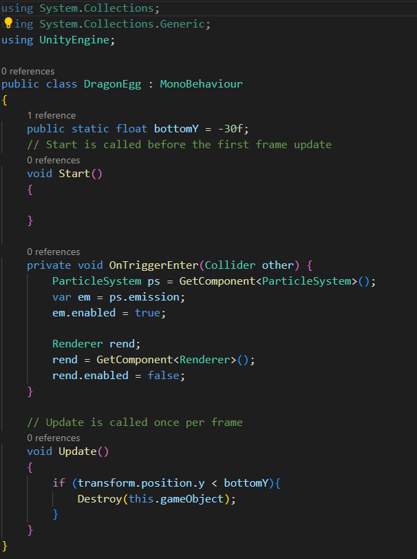

# Лабораторная работа № 2 Интеграция сервиса для получения данныхпрофиля пользователя.
Отчет по лабораторной работе №2 выполнил:
- Строшков Артем Валерьевич
- РИ-300004

Отметка о выполнении заданий (заполняется студентом):

| Задание | Выполнение | Баллы |
| ------ | ------ | ------ |
| Задание 1 | * |  |
| Задание 2 | * |  |
| Задание 3 | # |  |

знак "*" - задание выполнено; знак "#" - задание не выполнено;

Работу проверили:
- к.т.н., доцент Денисов Д.В.
- к.э.н., доцент Панов М.А.
- ст. преп., Фадеев В.О.

Структура отчета

- Данные о работе: название работы, фио, группа, выполненные задания.
- Цель работы.
- Задание 1.
- Код реализации выполнения задания. Визуализация результатов выполнения (если применимо).
- Задание 2.
- Код реализации выполнения задания. Визуализация результатов выполнения (если применимо).
- Задание 3.
- Код реализации выполнения задания. Визуализация результатов выполнения (если применимо).
- Выводы.
- ✨Magic ✨

## Цель работы
Создание интерактивного приложения и изучение принципов интеграции в него игровых сервисов.

## Задание 1
### По теме видео практических работ 1-5 повторить реализацию игры на Unity. Привести описание выполненных действий.

#### Ход работы (задание 1).
1) Создать новый проект из шаблона 3D – Core;
2) Скачать и импортировать нужные ассеты

3) Взять готовый префаб дракона и разместить на сцене

4) Создать контроллер анимации и добавить дракону анимацию полета

5) Создать объект драконьего яйца, сделать префаб

6) Создать объект энергетического щита, сделать префаб

7) Настроить главную камеру

8) Код C# для появления яйца, изменение направления полета дракона. Подключить префаб яйца

9) Добавить эффект взрыва при касании яйца земли, добавить землю

10) Написать скрипт, который будет управлять игрой;

## Задание 2
### Продемонстрируйте на сцене в Unity следующее:
#### - Что произойдёт с координатами объекта, если он перестанет быть дочерним?
#### - Создайте три различных примера работы компонента RigidBody

#### Ход работы (задание 2).
1)Объект является дочерним

2)Объект не является дочерним

Координаты дочернего перестают быть зависимыми от координат родительского объекта

3)Три примера работы компонента RigidBody:

Код:

AddExplosionForce

AddTorque

AddForce

## Задание 3
### Реализуйте на сцене генерацию n кубиков. Число n вводится пользователем после старта сцены.
#### Ход работы (задание 3).
1)Создан TMP_InputFIeld

2)Код

3)Выполнение

## Выводы
- Создал проект unity, в котором изучил взаимодейтсвие с объектами, работу rigidBody, элемент UI inputText и примитивные объекты unity

